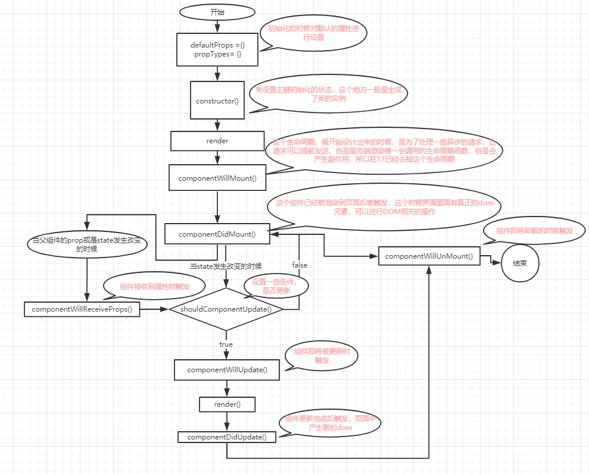

「[组件&Props](./03-组件&Props.md)」<--「[章节列表](../React概述.md)」-->「[事件处理](./05-事件处理.md)」

***

# State&生命周期

在「[元素渲染](./02-元素渲染.md)」一节中，我们只了解了一种更新UI界面的方法。也就是通过调用`ReactDOM.render()`来修改我们想要渲染的元素。  
我们当时说：“一般仅用`ReactDOM.render()`来做初次渲染”，那么在本节中，我们将学习react中常用的更新UI的方法。正如在「元素渲染」一节中实现的计时器的例子一样，在本节中我们将实现一个真正可复用的Clock组件。它将每秒更新一次时间。

首先，我们原始的组件代码应该如下例一样，采用`ReactDOM.render()`来做渲染：
```jsx
function Clock(props) {
  return (
    <div>
      <h1>Hello, world!</h1>
      <h2>It is {props.date.toLocaleTimeString()}.</h2>
    </div>
  );
}

function tick() {
  ReactDOM.render(
    <Clock date={new Date()} />,
    document.getElementById('root')
  );
}

setInterval(tick, 1000);
```

理想情况下，我们希望抛弃定时器，只编写一次代码，便可以让Clock组件自我更新：
```jsx
ReactDOM.render(
  <Clock />,
  document.getElementById('root')
);
```
我们需要在Clock组件中添加 “state” 来实现这个功能。

state结构上与props类似，但区别在于state是私有的，并且完全受控于当前组件。

### 将函数组件转换成class组件

通过以下五步将Clock的函数组件转成class组件：

1. 创建一个同名的 ES6 class，并且继承于`React.Component`。
2. 添加一个空的`render()`方法。
3. 将函数体移动到`render()`方法之中。
4. 在`render()`方法中使用`this.props`替换`props`。
5. 删除剩余的空函数声明。

于是Clock组件变成了：
```jsx
class Clock extends React.Component {
  render() {
    return (
      <div>
        <h1>Hello, world!</h1>
        <h2>It is {this.props.date.toLocaleTimeString()}.</h2>
      </div>
    );
  }
}
```

每次组件更新时其render方法都会被调用，但只要在相同的DOM节点中渲染`<Clock />`，就仅有一个Clock组件的class实例被创建使用（也就是说，render方法里return的内容一旦发生变化，render方法就会被再次调用，且对于同一个DOM节点再次调用render，并不会return一个新的节点，而是替换了之前的旧节点）。  
这就使得我们可以使用如state或生命周期方法等很多其他特性。

### 向class组件中添加局部的state

我们通过以下三步将date从props移动到state中：

1. 把`render()`方法中的`this.props.date`替换成`this.state.date`，于是将从父组件获取的数据（props）改为从本组件内（state）获取：
    ```jsx
    class Clock extends React.Component {
      render() {
        return (
          <div>
            <h1>Hello, world!</h1>
            <h2>It is {this.state.date.toLocaleTimeString()}.</h2>
          </div>
        );
      }
    }
    ```
2. 添加一个class构造函数，然后在该函数中为`this.state`赋初值：
    ```jsx
    class Clock extends React.Component {
      constructor(props) {
        super(props);//注意这里
        this.state = {date: new Date()};
      }

      render() {
        return (
          <div>
            <h1>Hello, world!</h1>
            <h2>It is {this.state.date.toLocaleTimeString()}.</h2>
          </div>
        );
      }
    }
    ```
    在这个构造器中，在使用`this.state`之前，先定义了一句`super(props)`，请务必要写上这一句，不然this就失效了，详细的原因请看：[super(props)](https://segmentfault.com/a/1190000018084870)。
    `super(props)`将props传递到父类的构造函数中，我们在Class组件中应该始终使用props参数来调用父类的构造函数。
3. 由于在`this.state`中添加了data属性，所以要移除`<Clock />`元素中的date属性：
    ```jsx
    ReactDOM.render(
      <Clock />,
      document.getElementById('root')
    );
    ```

经过这三步，我们已经将Clock组件改造完成。
```jsx
class Clock extends React.Component {
  constructor(props) {
    super(props);
    this.state = {date: new Date()};
  }

  render() {
    return (
      <div>
        <h1>Hello, world!</h1>
        <h2>It is {this.state.date.toLocaleTimeString()}.</h2>
      </div>
    );
  }
}

ReactDOM.render(
  <Clock />,
  document.getElementById('root')
);
```

但事实上由于对组件中的state我们并没有用计时器去每秒更新它，所以现在组件还不会刷新。

### 将生命周期方法添加到Class中

在具有许多组件的应用程序中，当组件被销毁时释放所占用的资源是非常重要的。

对于上例中的Clock组件，它第一次被渲染到DOM中的时候，我们就需要为其设置一个计时器。这在React中被称为“**挂载（mount）**”。

同时，当DOM中的Clock组件被删除的时候，我们应该要清除计时器。这在React中被称为“**卸载（unmount）**”。

我们可以为class组件声明一些特殊的方法，当组件挂载或卸载时就会去执行这些方法，也就是所谓的“生命周期方法”：
```jsx
class Clock extends React.Component {
  /*---生命周期的初始化阶段开始---*/
  //defaultProps //step1:设置组件的默认属性
  constructor(props) {/*---code---*/} //step2:设置组件的初始化状态
  //componentWillMount() //step3:被废弃组件
  //render() //step4:组件渲染
  componentDidMount() {} //step5:组件已经被渲染到页面中后触发
  /*---生命周期的初始化阶段结束---*/
  /*---生命周期的运行阶段开始---*/
  //componentWillReceiveProps(nextProps) {} //step1:被废弃组件，组件接收到属性时触发
  shouldComponentUpdate(nextProps, nextState) {} //step2:当组件接收到新属性，或者组件的状态发生改变时触发。组件首次渲染时并不会触发,这个生命周期的返回值是布尔值，会显示后续是否进行重新的渲染。详情请查看“高级指引：性能优化”一节
  //componentWillUpdate(nextProps, nextState) {} //step3:被废弃组件，组件即将被更新时触发
  componentDidUpdate(nextProps, nextState) {} //组件被更新完成后触发。页面中产生了新的DOM的元素，可以进行DOM操作
  /*---生命周期的运行阶段结束---*/
  /*---生命周期的销毁阶段开始---*/
  componentWillUnmount() {} //对轮询的请求的清理，或是对定时器的清理。
  /*---生命周期的销毁阶段结束---*/

  render() {/*---code---*/}
}
```
参考文章：
* [React生命周期的图解](https://www.jianshu.com/p/46022f1cbbb3)
* [详解React生命周期](https://www.jianshu.com/p/514fe21b9914)

作为对生命周期的描述，我们可以来看一下这张图：


回到之前的例子中，我们在Clock组件中需要设置定时器，一般我们都会用`componentDidMount()`方法（也就是在组件已经被渲染到DOM中后的时点）来设置：
```jsx
componentDidMount() {
  this.timerID = setInterval(
    () => this.tick(),
    1000
  );
}
```
这样之后，我们就把计时器的ID（this.timerID）保存在this之中了。

* 注意：尽管`this.props`和`this.state`是React本身设置的，且都拥有特殊的含义，但是其实我们可以向class中随意添加不参与数据流（比如这个例子中的计时器ID）的额外字段。

然后，在`componentWillUnmount()`生命周期方法中，我们会清除计时器：
```jsx
componentWillUnmount() {
  clearInterval(this.timerID);
}
```

写完生命周期方法后，最后不要忘记实现tick方法：
```jsx
tick() {
  this.setState({
    date: new Date()
  });
}
```
这里注意，我们来修改`this.state`中的值的时候，用的是`this.setState()`方法，其中传入的参数应该是我们想要修改成为的新对象，这个对象将会替换掉原来`this.state`中的值，关于其中的注意事项见下一段内容。

现在我们可以拿起在[React概述](../React概述.md)一节当中使用过的`Create React App`项目了，我们已经知道项目的主体代码都是写在`App.js`中，通过`index.js`被调用的。那么我们就可以将上面的例子整合起来全部写入到`App.js`中了：
```jsx
import React from 'react';
import './App.css';

class Clock extends React.Component {
  constructor(props) {
    super(props);
    this.state = {date: new Date()};
  }

  componentDidMount() {
    this.timerID = setInterval(
      () => this.tick(),
      1000
    );
  }

  componentWillUnmount() {
    clearInterval(this.timerID);
  }

  tick() {
    this.setState({
      date: new Date()
    });
  }

  render() {
    return (
      <div>
        <h1>Hello, world!</h1>
        <h2>It is {this.state.date.toLocaleTimeString()}.</h2>
      </div>
    );
  }
}

class App extends React.Component {
  render() {
    return (
      <Clock />
    )
  }
}

export default App;
```
运行项目后在浏览器中查看，Clock组件中的时间已经可以正常刷新了。

让我们来快速概括一下发生了什么和这些方法的调用顺序：

1. 当`<Clock />`被传给`ReactDOM.render()`的时候，React会调用Clock组件的构造函数。因为Clock需要显示当前的时间，所以它会用一个包含当前时间的对象来初始化`this.state`。我们会在之后更新state。
2. 之后React会调用组件的`render()`方法。这就是React确定该在页面上展示什么的方式。然后React更新DOM来匹配Clock渲染的输出。
3. 当Clock的输出被插入到DOM中后，React就会调用`ComponentDidMount()`生命周期方法。在这个方法中，Clock组件向浏览器请求设置一个计时器来每秒调用一次组件的`tick()`方法。
4. 浏览器每秒都会调用一次`tick()`方法。 在这方法之中，Clock组件会通过调用`setState()`来计划进行一次UI更新。得益于`setState()`的调用，React能够知道state已经改变了，然后会重新调用`render()`方法来确定页面上该显示什么。这一次，`render()`方法中的`this.state.date`就不一样了，如此以来就会渲染输出更新过的时间。React也会相应的更新DOM。
5. 一旦Clock组件从DOM中被移除，React就会调用`componentWillUnmount()`生命周期方法，这样计时器就停止了。

### 正确地使用State

在使用`setState()`的过程中，我们必须清楚了解三件事：

#### 1. 不要直接修改State

例如：~~`this.state.comment = 'Hello';`~~，请不要这样写。  
而是应该写成：`this.setState({comment: 'Hello'});`。

只需记住：构造函数是唯一可以给`this.state`赋值的地方。

#### 2. State的更新可能是异步的

出于性能考虑，React 可能会把多个`setState()`调用合并成一个调用。

这里也衍生出了一个问题：`setState()`是同步的呢还是异步的呢？  
（当前react下的）答案是：
1. 在组件生命周期中或者react事件绑定中，setState是通过异步更新的。
2. 在延时的回调或者原生事件绑定的回调中调用setState不一定是异步的。

在之后的react更新中，react倾向于将setState逐步改造为异步方法。

在这里推荐Dan Abramov（`redux`、以及我们很熟悉的`Create React App`的作者）的一篇博客，详细地解释了这个问题：  
[How Does setState Know What to Do?](https://overreacted.io/how-does-setstate-know-what-to-do/)

题外话：Dan Abramov大佬的文章写得深入浅出通俗易懂，非常推荐去人家的博客下学习。

回过来说，因为`this.props`和`this.state`可能会异步更新，所以请不要依赖他们的值来更新下一个状态。比如，对于下面的代码：

可能会无法更新计数器

***

「[组件&Props](./03-组件&Props.md)」<--「[章节列表](../React概述.md)」-->「[事件处理](./05-事件处理.md)」