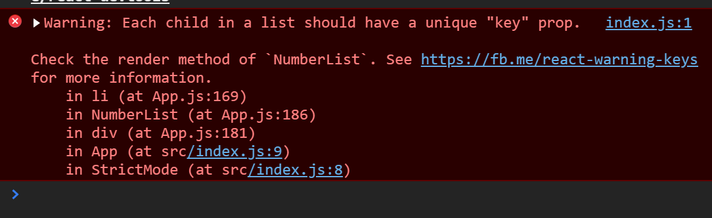
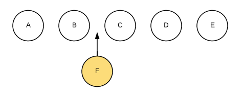
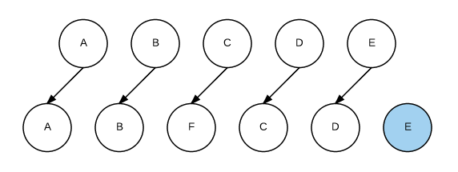
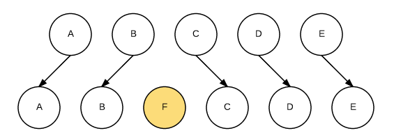

「[条件渲染](./06-条件渲染.md)」<--「[章节列表](../React概述.md)」-->「[表单](./08-表单.md)」

***

# 列表&Key

在Javascript中，我们要转化列表时，一般会用到[map()](https://developer.mozilla.org/zh-CN/docs/Web/JavaScript/Reference/Global_Objects/Array/map)函数。  
比如说，我们可以使用map()函数让数组中的每一项变双倍，然后得到一个新的列表doubled并打印出来：
```jsx
const numbers = [1, 2, 3, 4, 5];
const doubled = numbers.map((number) => number * 2);
console.log(doubled);
```
代码将会打印出[2, 4, 6, 8, 10]。

相对应地，在React中，把数组转化为元素列表的过程是相似的。

### 渲染多个组件

我们可以通过使用花括号在JSX内构建一个元素集合。比如下面的例子，我们用map()方法来遍历numbers数组。将数组中的每个元素变成`<li>`标签，最后我们将得到的数组赋值给listItems：
```jsx
const numbers = [1, 2, 3, 4, 5];
const listItems = numbers.map((number) =>
  <li>{number}</li>
);
```

我们把整个listItems插入到`<ul>`元素中，然后渲染进DOM：
```jsx
ReactDOM.render(
  <ul>{listItems}</ul>,
  document.getElementById('root')
);
```
这样一来就生成了一个1到5的项目符号列表。

### 基础列表组件

我们可以把前面的例子重构成一个组件，这个组件接收numbers数组作为参数并输出一个元素列表。
```jsx
function NumberList(props) {
  const numbers = props.numbers;
  const listItems = numbers.map((number) =>
    <li>{number}</li>
  );
  return (
    <ul>{listItems}</ul>
  );
}

const numbers = [1, 2, 3, 4, 5];
ReactDOM.render(
  <NumberList numbers={numbers} />,
  document.getElementById('root')
);
```
但在我们运行这段代码时，将会看到一个警告`Each child in a list should have a unique "key" prop.`：

其意思是在创建一个元素时，必须包括一个特殊的key属性。我们将在下一段讨论这是为什么。

让我们来给每个列表元素分配一个key属性来解决上面的那个警告：
```jsx
function NumberList(props) {
  const numbers = props.numbers;
  //在li标签中添加了key属性
  const listItems = numbers.map((number) =>
    <li key={number.toString()}>
      {number}
    </li>
  );
  return (
    <ul>{listItems}</ul>
  );
}

const numbers = [1, 2, 3, 4, 5];
ReactDOM.render(
  <NumberList numbers={numbers} />,
  document.getElementById('root')
);
```

## key

key帮助React识别哪些元素改变了，比如被添加或删除。key在react虚拟DOM的Diff算法中扮演了非常重要的角色，参考在[元素渲染](./02-元素渲染.md)一节提到过的[虚拟DOM的Diff算法](https://www.kancloud.cn/kancloud/react-in-depth/67091)，比方说，现在在某个父节点下有ABCDE五个子节点，需要在B和C中间插入一个F：


这时如果每个节点都没有唯一的标识，React无法识别每一个节点，那么更新过程会涉及到非常多的DOM操作进而导致效率低下，也就是A、B与原先相同不更新，F与原先的C不相同所以将C更新成F，然后将D、E更新成C、D，最后再插入一个E节点：


而如果给每个节点唯一的标识（key），那么React能够找到正确的位置去插入新的节点：


因此我们应当给数组中的每一个元素赋予一个确定的标识。基于上面的原理说明，一个元素的key最好是这个元素在列表中拥有的一个独一无二的字符串。通常，我们使用数据中的id来作为元素的key：
```jsx
const todoItems = todos.map((todo) =>
  <li key={todo.id}>
    {todo.text}
  </li>
);
```

当元素没有确定id的时候，万不得已可以使用元素索引index作为key：
```jsx
const todoItems = todos.map((todo, index) =>
  // Only do this if items have no stable IDs
  <li key={index}>
    {todo.text}
  </li>
);
```
在静态的数据展示中还是可以用index作为key的，但**在动态创建组件时，为了确保数据展示正确，请不要使用index作为key**，这样做会导致性能变差，还可能引起组件状态的问题，参考文章：
* [key的详细解释](https://segmentfault.com/a/1190000009149186)
* [使用index作为key是违反设计模式的](https://medium.com/@robinpokorny/index-as-a-key-is-an-anti-pattern-e0349aece318)
* [高级指引->协调](../AdvanacedGuides/15-协调.md)

但如果没有显式地指定key的值，那么React将默认使用索引用作为列表项目的key值。

### 用key提取组件

***

「[条件渲染](./06-条件渲染.md)」<--「[章节列表](../React概述.md)」-->「[表单](./08-表单.md)」